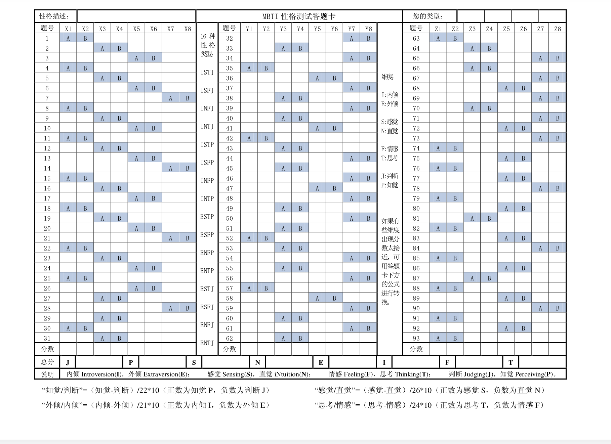

# MBTI

* [MBTI](https://github.com/Panda-Ghost/MBTI#mbti)
* [Code（SourceCode/mbti.cpp)](https://github.com/Panda-Ghost/MBTI#codesourcecodembticpp)
* [使用方法](https://github.com/Panda-Ghost/MBTI#使用方法)
* [题目资料](https://github.com/Panda-Ghost/MBTI#题目资料)
* [题目文档](https://github.com/Panda-Ghost/MBTI#题目文档)
* [计分](https://github.com/Panda-Ghost/MBTI#计分)
* [来源](https://github.com/Panda-Ghost/MBTI#来源)

## Code（SourceCode/mbti.cpp)

```cpp
#include<iostream>
#include<cstdlib>
using namespace std;
typedef long long ll;
const int J=1, P=2, S=3, N=4, E=5, I=6, F=7, T=8;
int sc[100]={-1,
1,2,3,1,2,3,4,1,2,3,1,2,3,4,1,2,3,1,2,3,4,1,2,3,1,3,2,4,2,1,2,
4,2,4,1,3,4,2,4,2,3,1,2,4,2,4,3,4,2,4,2,1,2,4,2,4,1,3,4,2,4,2,
1,2,4,2,4,3,4,2,4,3,4,1,3,1,3,4,1,3,2,1,3,4,1,3,2,1,3,4,1,3,1
};
int an[10];
string que[100]={
    "This is not a question!",
"1、当你某日想去某个地方，你会___?\n\
 A.计划好将做的事情以及何时做\n\
 B.什么都不想就去\n\
",
"2、如果你是一位老师，你愿教___?\n\
 A.涉及事实的课程\n\
 B.涉及理论的课程\n\
",
"3、你通常是___?\n\
 A.个善于交际的人\n\
 B.安静缄默的人\n\
",
"4、你喜欢___?\n\
 A.事先安排好约会，聚会等\n\
 B.只要时机恰当就无拘无束地做任何有趣的事\n\
",
"5、你通常和___相处得更好?\n\
 A.现实的人\n\
 B.想象力丰富的人\n\
",
"6、当你和一群人在一起时，你会___?\n\
 A.参加大家的谈话\n\
 B.只同你熟知的人单独谈话\n\
",
"7、往往，你是___?\n\
 A.情感驾驭理智\n\
 B.理智驾驭情感\n\
",
"8、你更喜欢___做多数事情?\n\
 A.有计划地\n\
 B.即兴时\n\
",
"9、你愿意自己被认为是一个___?\n\
 A.善于动手的人\n\
 B.善于创意的人\n\
",
"10、在大群体中，你常更多地___?\n\
 A.介绍他人\n\
 B.由别人来介绍你\n\
",
"11、按日程表办事___?\n\
 A.正合你意\n\
 B.束缚了你\n\
",
"12、你更喜欢___?\n\
 A.务实且有丰富常识的人\n\
 B.头脑灵活的人\n\
",
"13、你觉得通常别人要花费___?\n\
 A.一小段时间来了解你\n\
 B.很久来了解你\n\
",
"14、被称为___是更高的赞赏?\n\
 A.感性的人\n\
 B.一贯理性的人\n\
",
"15、对于制定周末计划，你觉得___?\n\
 A.很有必要\n\
 B.没必要\n\
",
"16、你愿把___作为朋友?\n\
 A.脚踏实地的人\n\
 B.常有新观点的人\n\
",
"17、多数时候，你倾向于___?\n\
 A.同他人在一起\n\
 B.独处\n\
",
"18、日常工作中，你喜欢___?\n\
 A.通常先安排好工作并加以完成，以免压力过大\n\
 B.在时间紧迫的情况下年分夺秒地工作\n\
",
"19、当你为了消遣而阅读时，你___?\n\
 A.喜欢作者确切地表达其意恩\n\
 B.欣赏奇特新颖的表达方式\n\
",
"20、你能否___?\n\
 A.只要愿意就能轻松地同几乎任何人说个没完\n\
 B.只能在特定场合下或同特定的人才愿意讲许多话\n\
",
"21、你更倾向于___?\n\
 A.感性地做事\n\
 B.依逻辑行事\n\
",
"22、当有一项特殊工作时，你会___?\n\
 A.在开始前精心组织策划\n\
 B.在工作进行中找出必要环节\n\
",
"23、做很多人都会做的事情时，你喜欢___?\n\
 A.按惯例做\n\
 B.按自己独创的方式做\n\
",
"24、你新认识的人___说出你的兴趣所在?\n\
 A.马上就能\n\
 B.只有当他们真正了解你之后才能\n\
",
"25、在计划一次旅行时，你更喜欢___?\n\
 A.事先就知道在大部分日子所将做的事情\n\
 B.在多数情况下随心所欲地行事\n\
",
"26、多数人认为你___?\n\
 A.非常坦率\n\
 B.不太把自己的事情告诉别人\n\
",
"27、A.事实 B.观点\n\
",
"28、A.热忱 B.坚决\n\
",
"29、A.切实 B.创新\n\
",
"30、A.有计划 B.随意\n\
",
"31、A.实在 B.抽象\n\
",
"32、A.感觉 B.思考\n\
",
"33、A.已知的 B.新颖的\n\
",
"34、A.感性 B.理性\n\
",
"35、A.安排好的 B.不受限制的\n\
",
"36、A.热情 B.安静\n\
",
"37、A.温柔 B.坚硬\n\
",
"38、A.陈述 B.观念\n\
",
"39、A.慈悲心肠 B.意志竖强\n\
",
"40、A.事实的 B.理论的\n\
",
"41、A.很多朋友 B.少许朋友\n\
",
"42、A.系统的 B.自发的\n\
",
"43、A.确定 B.推测\n\
",
"44、A.宽容 B.坚定\n\
",
"45、A.必然性 B.可能性\n\
",
"46、A.动之以情 B.晓之以理\n\
",
"47、A.健谈 B.缄默\n\
",
"48、A.温和 B.力量\n\
",
"49、A.现实 B.理想\n\
",
"50、A.好心的 B.称职的\n\
",
"51、A.事实 B.理论\n\
",
"52、A.系统 B.随机\n\
",
"53、A.现实的 B.想象的\n\
",
"54、A.易动情的 B.客观的\n\
",
"55、A.建造 B.发明\n\
",
"56、A.感情丰富的 B.注重实际的\n\
",
"57、A.有序的 B.随便的\n\
",
"58、A.开朗 B.文静\n\
",
"59、A.认同 B.分析\n\
",
"60、A.事实的 B.想象的\n\
",
"61、A.祝福 B.利益\n\
",
"62、A.详实 B.概括\n\
",
"63、A.决定 B.冲动\n\
",
"64、A.制作 B.创造\n\
",
"65、A.热情 B.客观\n\
",
"66、A.实用的 B.迷人的\n\
",
"67、A.体谅的 B.公正的\n\
",
"68、A.爱交际 B.爱文静\n\
",
"69、A.敏感 B.合理\n\
",
"70、A.制造 B.设计\n\
",
"71、A.有同情心 B.有逻辑头脑\n\
",
"72、A.公开的 B.私人的\n\
",
"73、A.同情怜悯 B.深谋远虑\n\
",
"74、通常你更喜欢___?\n\
 A.提前安排好业余活动\n\
 B.即兴地做事情\n\
",
"75、你觉得被许多人围着___?\n\
 A.让你感到更有精神\n\
 B.常让你精力衰竭\n\
",
"76、多数情況下，你更喜欢___?\n\
 A.按日程表办事\n\
 B.顺其自然\n\
",
"77、在聚会中，你___?\n\
 A.总是玩得很开心\n\
 B.有时觉得无趣\n\
",
"78、作决定时，对于你来说更重要的是___?\n\
 A.考虑人们的感受和观点\n\
 B.权衡事实\n\
",
"79、你喜欢___?\n\
 A.事先很早就作好准备\n\
 B.看清事念如何发展再作计划\n\
",
"80、别人___了解你?\n\
 A.很容易\n\
 B.很难\n\
",
"81、你喜欢的处事方式是___?\n\
 A.坚持那些己经有效的方法\n\
 B.分析哪些仍有错并挑战末解决的问题\n\
",
"82、你觉得自己更偏向于是一个___?\n\
 A.有组织性的人\n\
 B.自发性的人\n\
",
"83、你___?\n\
 A.只要愿意，就能和几乎任何一个人谈个没完\n\
 B.只同和自己有共同兴趣的人才能长时间的交谈\n\
",
"84、你愿在___一个老板（老师）手下工作（学习）?\n\
 A.脾气好，但前后不一致\n\
 B.对人严厉，但有条理\n\
",
"85、你更喜欢按照___做大多数事情?\n\
 A.已定的日程表\n\
 B.当天的感觉\n\
",
"86、在聚会中，你___?\n\
 A.自己聊得多\n\
 B.听别人聊得多\n\
",
"87、通常，你更喜欢上涉及___的课程?\n\
 A.具体内容\n\
 B.概念和原则\n\
",
"88、当你开始了一项必须在一周内完成的大项目时，你会___?\n\
 A.花时间列出所要做的事情及其先后次序\n\
 B.直接开始\n\
",
"89、在社交场合中，你通常觉得___?\n\
 A.很容易同大多数人长时间谈话\n\
 B.同某些人很难开展和维持长时间的谈话\n\
",
"90、被称为___是更高的赞赏?\n\
 A.富有同情心\n\
 B.有竞争力\n\
",
"91、你觉得按计划行事___?\n\
 A.多数时候是有帮助的、适宜的\n\
 B.有时必要，便令人不爽\n\
",
"92、你通常___?\n\
 A.同大家打成一片\n\
 B.倾向于独处\n\
",
"93、总的来说，要完成一项重大任务，你倾向于___?\n\
 A.开始先确定每一个步骤\n\
 B.边做边考虑必须完成的事\n\
"
};
//1 1-26
//2 27-73
//3 74-93
void score(int i, char ans){
    if(ans=='A'){
        an[2*sc[i]-1]++;
    }
    else if(ans=='B'){
        an[2*sc[i]]++;
    }else{
        printf("error!");
        exit(1);
    }
}
void A(int i){
    cout<<que[i]<<"请想好后输入选项（无法撤回）:";
    char c;
    cin>>c;
    while(c!='A'&&c!='B'){
        printf("请重新输入:");
        cin>>c;
    }
    score(i, c);
    cout<<endl;
}
int main(){
    printf("第一部分\n哪一答案最接近地描述了你通常的思考和行为方式\n\n");
    for(int i=1; i<=26; i++){
        A(i);
    }
    printf("\n第二部分\n在以下各对词中，你更倾向于哪一个。\n考虑以下这些词的意思，而不是它们好不好听或好不好看。\n\n");
    for(int i=27; i<=73; i++){
        A(i);
    }
    printf("\n第三部分\n哪个答案最接近地描述了你通常的思考和行为方式\n\n");  
    for(int i=74; i<=93; i++){
        A(i);
    }
    printf("\n===你是");
    putchar(an[I]>an[E]?'I':'E');
    putchar(an[N]>an[S]?'N':'S');
    putchar(an[T]>an[F]?'T':'F');
    putchar(an[P]>an[J]?'P':'J');
    printf("===\n");
    printf("各维度之比：\nI/E-%d/%d\nN/S-%d/%d\nT/F-%d/%d\nP/J-%d/%d\n",
    an[I],an[E],an[N],an[S],an[T],an[F],an[P],an[J]);
    printf("输入q退出");
    while(getchar()!='q');
    return 0;
}
```

## 使用方法

编译，控制台运行，答题就行了

# 题目资料

## 题目文档

```
MBTI性格测试 （93题）
该问卷用于揭示你是如何看待事物、如何做决定，答案无好坏之分。
问卷结果有助于了解自己的职业倾向、个性特征、人际相处的特征。
请仔细阅读每一个问题，答案直接写在题目上面
不必对问题想的太多，根据第一感觉回答即可。

第一部分
哪一答案最接近地描述了你通常的思考和行为方式

1、当你某日想去某个地方，你会___?
 A.计划好将做的事情以及何时做
 B.什么都不想就去
2、如果你是一位老师，你愿教___?
 A.涉及事实的课程
 B.涉及理论的课程
3、你通常是___?
 A.个善于交际的人
 B.安静缄默的人
4、你喜欢___?
 A.事先安排好约会，聚会等
 B.只要时机恰当就无拘无束地做任何有趣的事
5、你通常和___相处得更好?
 A.现实的人
 B.想象力丰富的人
6、当你和一群人在一起时，你会___?
 A.参加大家的谈话
 B.只同你熟知的人单独谈话
7、往往，你是___?
 A.情感驾驭理智
 B.理智驾驭情感
8、你更喜欢___做多数事情?
 A.有计划地
 B.即兴时
9、你愿意自己被认为是一个___?
 A.善于动手的人
 B.善于创意的人
10、在大群体中，你常更多地___?
 A.介绍他人
 B.由别人来介绍你
11、按日程表办事___?
 A.正合你意
 B.束缚了你
12、你更喜欢___?
 A.务实且有丰富常识的人
 B.头脑灵活的人
13、你觉得通常别人要花费___?
 A.一小段时间来了解你
 B.很久来了解你
14、被称为___是更高的赞赏?
 A.感性的人
 B.一贯理性的人
15、对于制定周末计划，你觉得___?
 A.很有必要
 B.没必要
16、你愿把___作为朋友?
 A.脚踏实地的人
 B.常有新观点的人
17、多数时候，你倾向于___?
 A.同他人在一起
 B.独处
18、日常工作中，你喜欢___?
 A.通常先安排好工作并加以完成，以免压力过大
 B.在时间紧迫的情况下年分夺秒地工作
19、当你为了消遣而阅读时，你___?
 A.喜欢作者确切地表达其意恩
 B.欣赏奇特新颖的表达方式
20、你能否___?
 A.只要愿意就能轻松地同几乎任何人说个没完
 B.只能在特定场合下或同特定的人才愿意讲许多话
21、你更倾向于___?
 A.感性地做事
 B.依逻辑行事
22、当有一项特殊工作时，你会___?
 A.在开始前精心组织策划
 B.在工作进行中找出必要环节
23、做很多人都会做的事情时，你喜欢___?
 A.按惯例做
 B.按自己独创的方式做
24、你新认识的人___说出你的兴趣所在?
 A.马上就能
 B.只有当他们真正了解你之后才能
25、在计划一次旅行时，你更喜欢___?
 A.事先就知道在大部分日子所将做的事情
 B.在多数情况下随心所欲地行事
26、多数人认为你___?
 A.非常坦率
 B.不太把自己的事情告诉别人

第二部分
在以下各对词中，你更倾向于哪一个。
考虑以下这些词的意思，而不是它们好不好听或好不好看。

27、A.事实 B.观点
28、A.热忱 B.坚决
29、A.切实 B.创新
30、A.有计划 B.随意
31、A.实在 B.抽象
32、A.感觉 B.思考
33、A.已知的 B.新颖的
34、A.感性 B.理性
35、A.安排好的 B.不受限制的
36、A.热情 B.安静
37、A.温柔 B.坚硬
38、A.陈述 B.观念
39、A.慈悲心肠 B.意志竖强
40、A.事实的 B.理论的
41、A.很多朋友 B.少许朋友
42、A.系统的 B.自发的
43、A.确定 B.推测
44、A.宽容 B.坚定
45、A.必然性 B.可能性
46、A.动之以情 B.晓之以理
47、A.健谈 B.缄默
48、A.温和 B.力量
49、A.现实 B.理想
50、A.好心的 B.称职的
51、A.事实 B.理论
52、A.系统 B.随机
53、A.现实的 B.想象的
54、A.易动情的 B.客观的
55、A.建造 B.发明
56、A.感情丰富的 B.注重实际的
57、A.有序的 B.随便的
58、A.开朗 B.文静
59、A.认同 B.分析
60、A.事实的 B.想象的
61、A.祝福 B.利益
62、A.详实 B.概括
63、A.决定 B.冲动
64、A.制作 B.创造
65、A.热情 B.客观
66、A.实用的 B.迷人的
67、A.体谅的 B.公正的
68、A.爱交际 B.爱文静
69、A.敏感 B.合理
70、A.制造 B.设计
71、A.有同情心 B.有逻辑头脑
72、A.公开的 B.私人的
73、A.同情怜悯 B.深谋远虑

第三部分
哪个答案最接近地描述了你通常的思考和行为方式

74、通常你更喜欢___?
 A.提前安排好业余活动
 B.即兴地做事情
75、你觉得被许多人围着___?
 A.让你感到更有精神
 B.常让你精力衰竭
76、多数情況下，你更喜欢___?
 A.按日程表办事
 B.顺其自然
77、在聚会中，你___?
 A.总是玩得很开心
 B.有时觉得无趣
78、作决定时，对于你来说更重要的是___?
 A.考虑人们的感受和观点
 B.权衡事实
79、你喜欢___?
 A.事先很早就作好准备
 B.看清事念如何发展再作计划
80、别人___了解你?
 A.很容易
 B.很难
81、你喜欢的处事方式是___?
 A.坚持那些己经有效的方法
 B.分析哪些仍有错并挑战末解决的问题
82、你觉得自己更偏向于是一个___?
 A.有组织性的人
 B.自发性的人
83、你___?
 A.只要愿意，就能和几乎任何一个人谈个没完
 B.只同和自己有共同兴趣的人才能长时间的交谈
84、你愿在___一个老板（老师）手下工作（学习）?
 A.脾气好，但前后不一致
 B.对人严厉，但有条理
85、你更喜欢按照___做大多数事情?
 A.已定的日程表
 B.当天的感觉
86、在聚会中，你___?
 A.自己聊得多
 B.听别人聊得多
87、通常，你更喜欢上涉及___的课程?
 A.具体内容
 B.概念和原则
88、当你开始了一项必须在一周内完成的大项目时，你会___?
 A.花时间列出所要做的事情及其先后次序
 B.直接开始
89、在社交场合中，你通常觉得___?
 A.很容易同大多数人长时间谈话
 B.同某些人很难开展和维持长时间的谈话
90、被称为___是更高的赞赏?
 A.富有同情心
 B.有竞争力
91、你觉得按计划行事___?
 A.多数时候是有帮助的、适宜的
 B.有时必要，便令人不爽
92、你通常___?
 A.同大家打成一片
 B.倾向于独处
93、总的来说，要完成一项重大任务，你倾向于___?
 A.开始先确定每一个步骤
 B.边做边考虑必须完成的事
```

## 计分




## 来源

[MBTI性格测试题及计分标准(93题) - 豆丁网 (docin.com)](https://www.docin.com/p-607797782.html)
